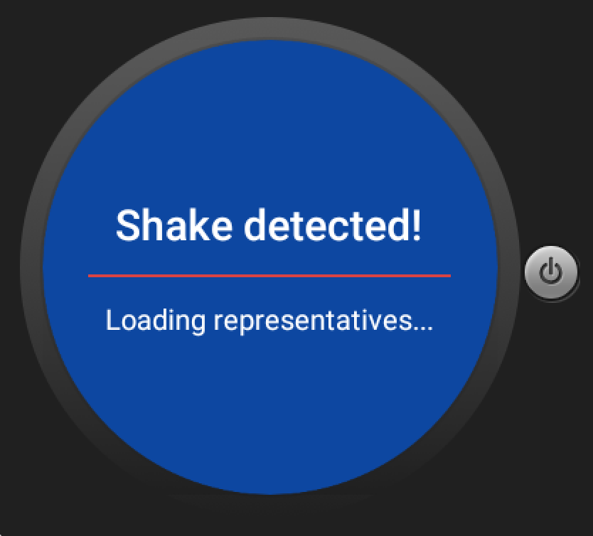

# PROG 02: Represent!

Represent! is a mobile and wear application for location based information on congressional representatives. This is the perfect app for voters on the go!

## Authors

Annie Lo ([annielo@berkeley.edu](mailto:annielo@berkeley.edu))

## Demo Video

See [Represent! PROG 2C] (https://www.youtube.com/watch?v=ZB4SCJQYTpM)

## Screenshots
###Mobile View:
Main

Congressional View

Detail View

###Watch View:
Home

Main/Congressional View

Vote View

Shake!

## Acknowledgments
APIs Used:
* [Google Location] (http://developer.android.com/intl/es/training/location/index.html)
* [Google Geocoding] (https://developers.google.com/maps/documentation/geocoding/intro#ReverseGeocoding)
* [Twitter] (https://dev.twitter.com/overview/api)
* [Sunlight Foundation API] (http://tryit.sunlightfoundation.com/congress)
* [2012 Presidential Voting Data in JSON] (https://d1b10bmlvqabco.cloudfront.net/attach/ijddlu9pcyk1sk/hq1pd634o47ic/ilndte8ipnrj/newelectioncounty2012.json)

Some helpful links:
* [RecyclerView and CardView] (https://www.binpress.com/tutorial/android-l-recyclerview-and-cardview-tutorial/156)
* [ShakeEventListener] (http://stackoverflow.com/questions/2317428/android-i-want-to-shake-it)
* [Retrieve Tweets with User ID] (https://twittercommunity.com/t/test-run-with-fabric-android/60673)
* [Pop Up Window] (http://stackoverflow.com/questions/27409781/how-to-define-layout-in-a-popupwindow-from-an-xml-file-when-popupwindow-method)

